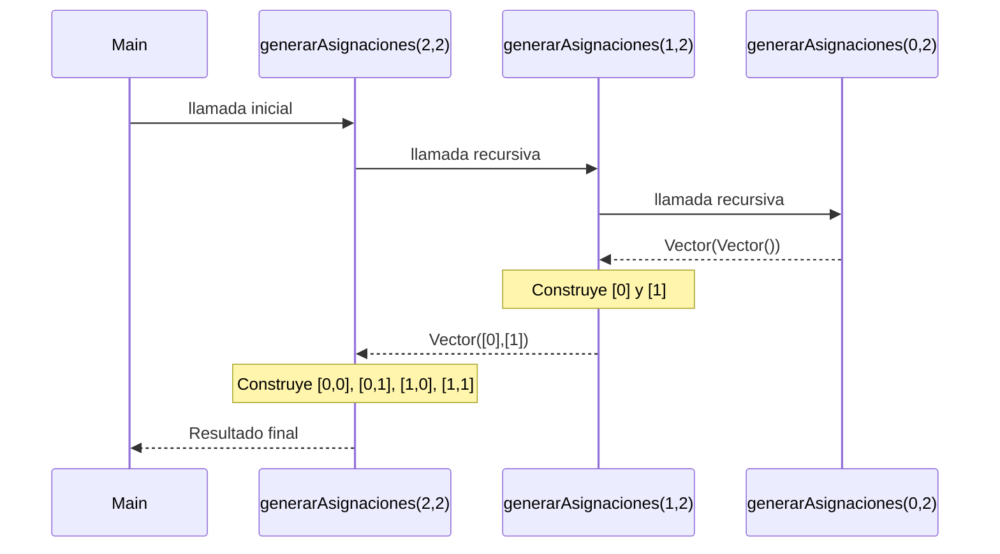
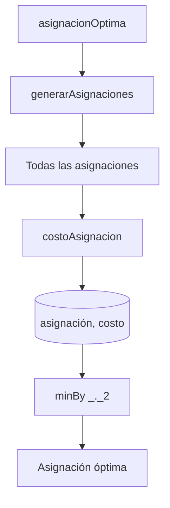

# Informe de proceso 

## 1. Función `solapan`

### Definición del Algoritmo
```scala
def solapan(c1: Curso, c2: Curso): Boolean = {
  iniCurso(c1) < finCurso(c2) && iniCurso(c2) < finCurso(c1)
}

```

La función determina si dos cursos individuales se cruzan en sus franjas horarias. Recibe dos estructuras de tipo `Curso` y, mediante proyecciones de acceso a sus atributos (hora de inicio y fin), evalúa de forma atómica su simultaneidad.

### Explicación Paso a Paso y Proceso de Ejecución

1. **Extracción de Atributos:** Se consultan los valores enteros de inicio y fin para ambos cursos: `iniCurso(c1)`, `finCurso(c1)`, `iniCurso(c2)`, `finCurso(c2)`.
2. **Evaluación de Cotas Cruzadas:**
* Verifica si el inicio del primer curso ocurre estrictamente antes del fin del segundo (`iniCurso(c1) < finCurso(c2)`).
* Simultáneamente (`&&`), verifica si el inicio del segundo curso ocurre estrictamente antes del fin del primero (`iniCurso(c2) < finCurso(c1)`).


3. **Retorno:** Devuelve un valor booleano (`True` o `False`).

```
    Curso C1:   [───────)
    Curso C2:        [───────)
    Evaluación: (IniC1 < FinC2) AND (IniC2 < FinC1) ──► Resultado: True (Se cruzan)

```

### Complejidad

* **Complejidad Temporal:** $\mathcal{O}(1)$ (Tiempo constante). Únicamente ejecuta operaciones de comparación aritmética básica sobre tipos primitivos.
* **Complejidad Espacial:** $\mathcal{O}(1)$ (Espacio constante). No genera estructuras de datos en memoria.

---

## 2. Función `choques`

### Definición del Algoritmo

```scala
def choques(cursos: Cursos, a: Asignacion): Int = {
  (0 until cursos.length).flatMap { i =>
    (i + 1 until cursos.length).map { j =>
      if (a(i) == a(j) && a(i) >= 0 && solapan(cursos(i), cursos(j))) 1 else 0
    }
  }.sum
}

```

Calcula la cantidad total de conflictos de horarios debido a cursos concurrentes que comparten la misma aula en una asignación dada.

### Explicación Paso a Paso y Proceso de Ejecución

1. **Generación del Espacio Combinatorio ($i < j$):**
* El rango externo `(0 until cursos.length)` itera sobre cada curso $i$.
* El rango interno `(i + 1 until cursos.length)` genera índices $j$ estrictamente mayores que $i$, formando parejas sin repetir permutaciones simétricas.


2. **Evaluación del Predicado Combinado:** Para cada pareja $(i, j)$, se evalúa si están en la misma aula (`a(i) == a(j)`), si es una asignación física válida (`a(i) >= 0`), y si sus horarios entran en conflicto a través de la función `solapan`.
3. **Mapeo e Integración Funcional:** Cada validación exitosa se transforma en un `1` (o `0` si no hay choque). El uso de `.flatMap` unifica las colecciones de colecciones internas en un único flujo de enteros unidimensional.
4. **Reducción:** El método `.sum` totaliza los unos del vector plano para consolidar el total de choques.

```
(0 until N) ──flatMap──► i = 0 ──map (j de 1 a N-1) ──► Vector(0, 1, 0...) ──┐
                         i = 1 ──map (j de 2 a N-1) ──► Vector(0, 0...)    ──┼─► [Vector Plano] ──.sum ──► Total

```

### Complejidad

* **Complejidad Temporal:** $\mathcal{O}(n^2)$, donde $n$ es la cantidad de cursos. El número de evaluaciones de pares corresponde estrictamente a la sumatoria combinatoria $\frac{n(n-1)}{2}$.
* **Complejidad Espacial:** $\mathcal{O}(n^2)$ en el peor de los casos, debido a la asignación en memoria del vector intermedio plano generado por el `flatMap` antes de aplicar la reducción `.sum`.

---

## 3. Función `capacidadFallida`

### Definición del Algoritmo

```scala
def capacidadFallida(cursos: Cursos, aulas: Aulas, a: Asignacion): Int = {
  cursos.indices.count { i => a(i) >= 0 && capAula(aulas(a(i))) < estCurso(cursos(i)) }
}

```

Cuenta cuántos cursos han sido asignados a aulas cuya capacidad máxima de asientos es inferior a la cantidad de estudiantes matriculados en dicho curso.

### Explicación Paso a Paso y Proceso de Ejecución

1. **Mapeo del Dominio:** Se extrae el rango total de índices válidos del vector de cursos mediante `cursos.indices` ($0$ hasta $N-1$).
2. **Filtro y Contación Predictiva:** El combinador de alto orden `.count` evalúa secuencialmente cada índice $i$:
* Valida si el aula asignada en la posición $i$ es real (`a(i) >= 0`).
* Si es verdadera, extrae el objeto aula `aulas(a(i))` para comparar su capacidad (`capAula`) frente a los estudiantes requeridos por el curso `estCurso(cursos(i))`.


3. **Acumulación:** El contador interno incrementa automáticamente en una unidad por cada evaluación que retorne un valor booleano verdadero.

```
cursos.indices ──► [0, 1, 2, ..., N-1] ──► .count( i => PredicadoCapacidad ) ──► Entero Absoluto

```

### Complejidad

* **Complejidad Temporal:** $\mathcal{O}(n)$, donde $n$ es la cantidad de cursos. Requiere recorrer de manera lineal y exhaustiva el arreglo una sola vez.
* **Complejidad Espacial:** $\mathcal{O}(1)$ (Espacio constante). La evaluación por predicado de conteo no asigna colecciones intermedias en el Heap.

---

## 4. Función `desperdicio`

### Definición del Algoritmo

```scala
def desperdicio(cursos: Cursos, aulas: Aulas, a: Asignacion): Int = {
  cursos.indices.map { i =>
    if (a(i) >= 0 && capAula(aulas(a(i))) >= estCurso(cursos(i)))
      capAula(aulas(a(i))) - estCurso(cursos(i))
    else
      0
  }.sum
}

```

Cuantifica de forma global la cantidad de sillas que quedan vacías en el sistema, sumando la holgura remante de cada aula que cumple con el aforo.

### Explicación Paso a Paso y Proceso de Ejecución

1. **Transformación Lineal (`.map`):** Recorre el conjunto indexado de los cursos. Para cada elemento $i$, ejecuta una ramificación condicional:
* **Condición Exitosa:** Si el aula asignada existe (`a(i) >= 0`) y su tamaño es mayor o igual a la demanda del curso, calcula el desperdicio marginal restando algebraicamente: `capAula - estCurso`.
* **Condición de Falla:** Si no está asignado o no cabe, el desperdicio marginal para ese curso se define neutralmente como `0`.


2. **Generación del Vector de Sillas Libres:** `.map` genera un nuevo `Vector[Int]` de tamaño idéntico al número de cursos, conteniendo los desperdicios calculados independientemente.
3. **Consolidación Terminal:** `.sum` procesa el vector intermedio acumulando linealmente los costos de ineficiencia física.

```
[0, 1, ..., N-1] ──.map──► [Desperdicio_0, Desperdicio_1, ..., 0] ──.sum──► Total Desperdicio

```

### Complejidad

* **Complejidad Temporal:** $\mathcal{O}(n)$, donde $n$ es la cantidad de cursos. Realiza una iteración para la proyección de mapeo y otra para la reducción aditiva.
* **Complejidad Espacial:** $\mathcal{O}(n)$, debido a que la operación inmutable de transformación `.map` instancia un vector intermedio de enteros que aloja los costos calculados por cada índice.

---

## 5. Función `movilidad`

### Definición del Algoritmo

```scala
def movilidad(cursos: Cursos, aulas: Aulas, d: Distancias, a: Asignacion): Int = {
  val cursosAsignados = cursos.indices.filter(i => a(i) >= 0)
    .sortBy(i => iniCurso(cursos(i)))

  cursosAsignados.sliding(2).collect {
    case Vector(i, j) => d(a(i))(a(j))
  }.sum
}

```

Mide el costo logístico de desplazamiento físico, calculando las distancias consecutivas que deben recorrerse entre aulas según la secuencia cronológica de las clases válidamente agendadas.

### Explicación Paso a Paso y Proceso de Ejecución

1. **Filtrado de Inclusiones:** Evalúa todos los índices de cursos mediante `.filter`, descartando aquellos que no tienen un aula física asignada (`a(i) < 0`).
2. **Ordenamiento Temporal:** Los índices resultantes se ordenan de manera ascendente con `.sortBy` utilizando como criterio la hora de inicio del curso (`iniCurso(cursos(i))`), garantizando la cronología secuencial.
3. **Segmentación por Ventana Móvil (`.sliding(2)`):** Agrupa la colección ordenada en subvectores de pares contiguos adyacentes de tamaño dos, simulando transiciones directas de un curso $i$ al curso siguiente $j$.
4. **Consulta Matricial (`.collect`):** Extrae por patrón estructurado `Vector(i, j)` los índices de los cursos e interpola sus respectivas aulas asignadas para indexar la matriz bidimensional de distancias: `d(a(i))(a(j))`.
5. **Reducción de Tránsito:** Acumula la secuencia de distancias mediante `.sum` para obtener el costo neto de movilidad.

```
cursos.indices ──► .filter ──► .sortBy(Cronología) ──► .sliding(2) ──► [ (i,j), (j,k) ] ──► .collect(Matriz d) ──► .sum ──► Movilidad Total

```

### Complejidad

* **Complejidad Temporal:** $\mathcal{O}(n \log n)$, donde $n$ es el número de cursos. El ordenamiento de la colección (`.sortBy`), implementado bajo el algoritmo estable de Scala, domina computacionalmente sobre los recorridos lineales previos de filtrado y posteriores de ventanas deslizantes ($\mathcal{O}(n)$).
* **Complejidad Espacial:** $\mathcal{O}(n)$. Al operar bajo transformaciones de colecciones funcionales inmutables, los pasos intermedios (`cursosAsignados` filtrados, la secuencia ordenada y los iteradores de ventanas deslizantes) alojan nuevos nodos y vectores de punteros en la memoria dinámica.

---

## 6. Función `costoAsignacion`

### Definición del Algoritmo

```scala
def costoAsignacion(cursos: Cursos, aulas: Aulas, d: Distancias,
                    a: Asignacion, w: Pesos): Int = {
  val (wCH, wCF, wDE, wMV) = w

  wCH * choques(cursos, a) +
    wCF * capacidadFallida(cursos, aulas, a) +
    wDE * desperdicio(cursos, aulas, a) +
    wMV * movilidad(cursos, aulas, d, a)
}

```

Funciona como la función objetivo global del sistema. Consolida un costo numérico entero parametrizado mediante una combinación lineal ponderada de los costos marginales individuales de restricciones y métricas operativas.

### Explicación Paso a Paso y Proceso de Ejecución

1. **Desestructuración de Parámetros:** Desempaqueta mediante concordancia de patrones (*pattern matching*) la tupla de configuración de pesos `w`, asignando coeficientes escalares independientes a variables locales fijas: `wCH` (choques), `wCF` (capacidad fallida), `wDE` (desperdicio), y `wMV` (movilidad).
2. **Invocación de Subrutinas:** Ejecuta las 5 funciones secuenciales previas pasándoles los parámetros de contexto inmutables (`cursos`, `aulas`, `d`, `a`).
3. **Escalamiento y Combinación:** Multiplica algebraicamente el valor entero devuelto por cada subfunción por su respectivo factor de ponderación reglamentado por el vector de pesos.
4. **Adición Terminal:** Suma los cuatro productos resultantes y devuelve el valor acumulado que califica el rendimiento total de la asignación analizada.

```
                  ┌──► choques ─────────── × wCH ──┐
                  ├──► capacidadFallida ── × wCF ──┼
Matriz de Pesos ──┼                                ├──► (+) Suma combinada ──► Costo Neto
                  ├──► desperdicio ─────── × wDE ──┼
                  └──► movilidad ───────── × wMV ──┘

```

### Complejidad

* **Complejidad Temporal:** $\mathcal{O}(n^2)$, donde $n$ es el número de cursos. Dado que las funciones se ejecutan de manera secuencial, la complejidad global está dominada por el componente asintótico más costoso del sistema, el cual corresponde a la función `choques` con su doble ciclo anidado de complejidad cuadrática ($\mathcal{O}(n^2)$), superando al ordenamiento lineal-logarítmico de la movilidad ($\mathcal{O}(n \log n)$).
* **Complejidad Espacial:** $\mathcal{O}(n^2)$, determinada igualmente por la asignación de memoria intermedia requerida por el aplanamiento de colecciones anidadas en la función de detección de choques.


## Función `generarAsignaciones`
## Definición del Algoritmo 

```Scala
def generarAsignaciones(n: Int, m: Int): Vector[Asignacion] = {
  if (n == 0)
    Vector(Vector.empty[Int])
    
  else {


    val anteriores = generarAsignaciones(n-1,m)
    
    for {
      asignacion <- anteriores
      aula <- 0 until m
    } yield  asignacion :+ aula
  }
}
```

- La función `generarAsignaciones` genera todas las asignaciones posibles de n cursos en m aulas.
- Cada asignación se representa mediante un vector de enteros.
- El valor almacenado en cada posición indica el aula asignada a un curso.
- La función utiliza recursión estructural, reduciendo el número de cursos pendientes de asignar hasta llegar al caso base.

## Explicación paso a paso

### Caso base

```Scala
if (n == 0)
  Vector(Vector.empty[Int])
```

Cuando no quedan cursos por asignar `(n = 0)`, existe una única asignación posible: la asignación vacía.

Por ello la función retorna:
`Vector(Vector())`

### Caso recursivo

```Scala
val anteriores = generarAsignaciones(n - 1, m)
```
La función genera primero todas las asignaciones posibles para `n - 1` cursos.

Posteriormente:

```Scala
for {
  asignacion <- anteriores
  aula <- 0 until m
} yield  asignacion :+ aula
```
Para cada asignación generada anteriormente, agrega cada aula posible al final del vector.

De esta forma se construyen todas las asignaciones posibles para n cursos.


---

## Llamados de pila 
Ejemplo:

```Scala
generarAsignaciones(2, 2)
```
Esto significa:

- 2 cursos.
- 2 aulas posibles: {0,1}.


### Paso 1: Llamada inicial

```Scala
generarAsignaciones(2,2)  //Resuelve generarAsignaciones(1,2)
```

### Paso 2: Segunda llamada

```Scala
generarAsignaciones(1,2)  // Resuelve generarAsignaciones(0,2)
```

### Paso 3: Caso base

```Scala
generarAsignaciones(0,2)  // Retorna: Vector(Vector())
```

### Paso 4: Retorno a generarAsignaciones(1,2)

```Scala
anteriores = Vector(Vector())  

//Para cada asignación vacía se agregan todas las aulas posibles. 
// Resultado:

        Vector(
        Vector(0),
        Vector(1)
)
```

### Paso 5: Retorno a generarAsignaciones(2,2)

```Scala
anteriores = Vector( Vector(0), Vector(1) ) 
```
Para cada asignación se agregan nuevamente todas las aulas posibles.

Resultado: 

Vector( Vector(0,0), Vector(0,1), Vector(1,0), Vector(1,1) )

### Paso 6: Resultado final

```Scala
generarAsignaciones(2,2)
```
retorna:

Vector(
Vector(0,0),
Vector(0,1),
Vector(1,0),
Vector(1,1)
)

## Evolución de la pila de llamadas

Durante la ejecución se generan las siguientes llamadas recursivas:

```
generarAsignaciones(2,2)
│
└── generarAsignaciones(1,2)
    │
    └── generarAsignaciones(0,2)
```

Al llegar al caso base la pila comienza a resolverse en sentido contrario:

```
generarAsignaciones(0,2)
      ↓
generarAsignaciones(1,2)
      ↓
generarAsignaciones(2,2)
```

## Árbol de construcción de soluciones

```
                 []
               /    \
             [0]    [1]
            /   \   /   \
        [0,0] [0,1] [1,0] [1,1]
```

**Interpretación:**

- La raíz representa la asignación vacía.
- Cada nivel corresponde a un curso.
- Cada rama representa una posible aula asignada.
- Las hojas corresponden a asignaciones completas.

## Complejidad

Para cada uno de los `n` cursos existen `m` posibles aulas.
Por lo tanto, el número total de asignaciones generadas es:

$$m^n$$

La complejidad temporal de la función es:

$$O(m^n)$$

por lo que el crecimiento del espacio de búsqueda es exponencial.

## Ejemplo de uso

```scala
val asignaciones = generarAsignaciones(2, 2)
println(asignaciones)
```

**Salida:**

```
Vector(
  Vector(0, 0),
  Vector(0, 1),
  Vector(1, 0),
  Vector(1, 1)
)
```

## Diagrama de llamados de pila 




---

## Informe de proceso — Función `asignacionOptima`

## Definición del Algoritmo

```scala
def asignacionOptima(cursos: Cursos, aulas: Aulas,
                     d: Distancias, w: Pesos): (Asignacion, Int) = {

  val todas = generarAsignaciones(cursos.length, aulas.length)

  todas.map { asignacion =>
    (asignacion,
     costoAsignacion(cursos, aulas, d, asignacion, w))
  }
  .minBy(_._2)
}
```


- La función `asignacionOptima` busca la asignación de aulas con el menor costo posible.
- Para ello genera primero todas las asignaciones posibles mediante la función `generarAsignaciones`.
- Posteriormente calcula el costo de cada asignación usando la función `costoAsignacion`.
- Finalmente selecciona la asignación cuyo costo es mínimo mediante la función `minBy`.

---

## Explicación paso a paso

### Paso 1: Generar todas las asignaciones posibles

```scala
val todas = generarAsignaciones(
  cursos.length,
  aulas.length
)
```

Si existen 2 cursos y 2 aulas, la función genera:

```scala
Vector(
  Vector(0, 0),
  Vector(0, 1),
  Vector(1, 0),
  Vector(1, 1)
)
```

Cada vector representa una asignación completa de cursos a aulas.

---

### Paso 2: Calcular el costo de cada asignación

```scala
todas.map { asignacion =>
  (
    asignacion,
    costoAsignacion(cursos, aulas, d, asignacion, w)
  )
}
```

Para cada asignación se construye una tupla `(asignacion, costo)`. Ejemplo:

```scala
Vector(
  (Vector(0, 0), 120),
  (Vector(0, 1),  40),
  (Vector(1, 0),  50),
  (Vector(1, 1), 100)
)
```

---

### Paso 3: Seleccionar la asignación de menor costo

```scala
.minBy(_._2)
```

La expresión `_._2` indica que la comparación se realiza usando el segundo elemento de cada tupla, es decir, el costo.

Continuando con el ejemplo anterior, el costo mínimo es `40`, por lo que la función retorna:

```scala
(Vector(0, 1), 40)
```

---

## Proceso de ejecución

```
asignacionOptima
       │
       ▼
generarAsignaciones
       │
       ▼
todas las asignaciones
       │
       ▼
map + costoAsignacion
       │
       ▼
(asignacion, costo)
       │
       ▼
minBy(_._2)
       │
       ▼
asignación óptima
```

---

## Complejidad

La función genera todas las asignaciones posibles $m^n$, donde:

- $n$ es el número de cursos.
- $m$ es el número de aulas.

Posteriormente calcula el costo de cada una. Por lo tanto, la complejidad está dominada por la generación y evaluación de todas las asignaciones posibles:

$$O(m^n)$$

lo que corresponde a un crecimiento exponencial.

---

## Ejemplo de uso

```scala
val (asignacion, costo) =
  asignacionOptima(cursos, aulas, d, w)

println(asignacion)
println(costo)
```

**Salida posible:**

```scala
Vector(0, 1)
40
```

La función retorna:

- La asignación de menor costo.
- El valor de dicho costo.


## Diagrama de ejecución 


---

