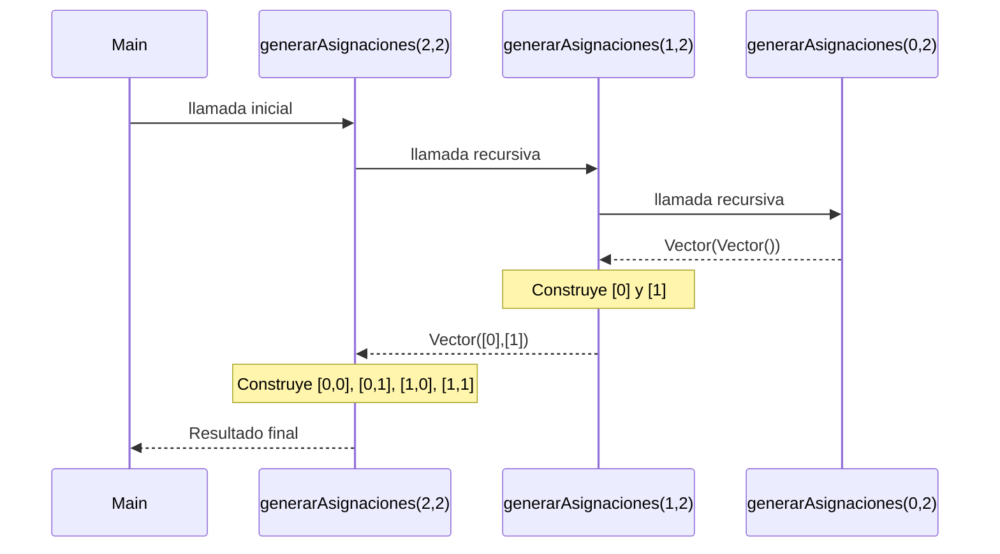
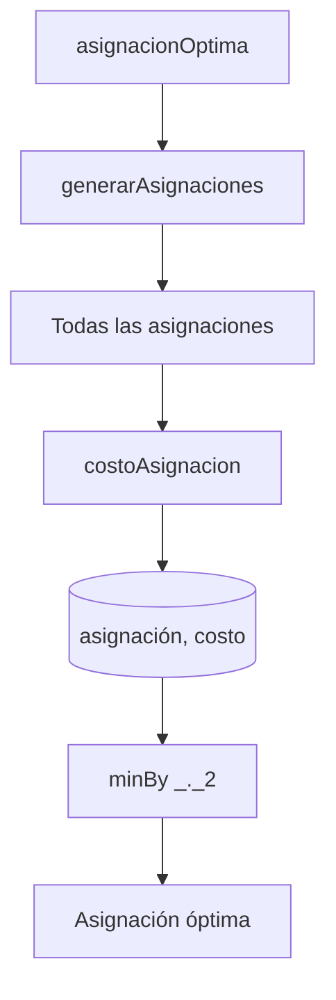

# Informe de proceso 

## Función `generarAsignaciones`
## Definición del Algoritmo 

```Scala
def generarAsignaciones(n: Int, m: Int): Vector[Asignacion] = {
  if (n == 0)
    Vector(Vector.empty[Int])
    
  else {


    val anteriores = generarAsignaciones(n-1,m)
    
    for {
      asignacion <- anteriores
      aula <- 0 until m
    } yield  asignacion :+ aula
  }
}
```

- La función `generarAsignaciones` genera todas las asignaciones posibles de n cursos en m aulas.
- Cada asignación se representa mediante un vector de enteros.
- El valor almacenado en cada posición indica el aula asignada a un curso.
- La función utiliza recursión estructural, reduciendo el número de cursos pendientes de asignar hasta llegar al caso base.

## Explicación paso a paso

### Caso base

```Scala
if (n == 0)
  Vector(Vector.empty[Int])
```

Cuando no quedan cursos por asignar `(n = 0)`, existe una única asignación posible: la asignación vacía.

Por ello la función retorna:
`Vector(Vector())`

### Caso recursivo

```Scala
val anteriores = generarAsignaciones(n - 1, m)
```
La función genera primero todas las asignaciones posibles para `n - 1` cursos.

Posteriormente:

```Scala
for {
  asignacion <- anteriores
  aula <- 0 until m
} yield  asignacion :+ aula
```
Para cada asignación generada anteriormente, agrega cada aula posible al final del vector.

De esta forma se construyen todas las asignaciones posibles para n cursos.


---

## Llamados de pila 
Ejemplo:

```Scala
generarAsignaciones(2, 2)
```
Esto significa:

- 2 cursos.
- 2 aulas posibles: {0,1}.


### Paso 1: Llamada inicial

```Scala
generarAsignaciones(2,2)  //Resuelve generarAsignaciones(1,2)
```

### Paso 2: Segunda llamada

```Scala
generarAsignaciones(1,2)  // Resuelve generarAsignaciones(0,2)
```

### Paso 3: Caso base

```Scala
generarAsignaciones(0,2)  // Retorna: Vector(Vector())
```

### Paso 4: Retorno a generarAsignaciones(1,2)

```Scala
anteriores = Vector(Vector())  

//Para cada asignación vacía se agregan todas las aulas posibles. 
// Resultado:

        Vector(
        Vector(0),
        Vector(1)
)
```

### Paso 5: Retorno a generarAsignaciones(2,2)

```Scala
anteriores = Vector( Vector(0), Vector(1) ) 
```
Para cada asignación se agregan nuevamente todas las aulas posibles.

Resultado: 

Vector( Vector(0,0), Vector(0,1), Vector(1,0), Vector(1,1) )

### Paso 6: Resultado final

```Scala
generarAsignaciones(2,2)
```
retorna:

Vector(
Vector(0,0),
Vector(0,1),
Vector(1,0),
Vector(1,1)
)

## Evolución de la pila de llamadas

Durante la ejecución se generan las siguientes llamadas recursivas:

```
generarAsignaciones(2,2)
│
└── generarAsignaciones(1,2)
    │
    └── generarAsignaciones(0,2)
```

Al llegar al caso base la pila comienza a resolverse en sentido contrario:

```
generarAsignaciones(0,2)
      ↓
generarAsignaciones(1,2)
      ↓
generarAsignaciones(2,2)
```

## Árbol de construcción de soluciones

```
                 []
               /    \
             [0]    [1]
            /   \   /   \
        [0,0] [0,1] [1,0] [1,1]
```

**Interpretación:**

- La raíz representa la asignación vacía.
- Cada nivel corresponde a un curso.
- Cada rama representa una posible aula asignada.
- Las hojas corresponden a asignaciones completas.

## Complejidad

Para cada uno de los `n` cursos existen `m` posibles aulas.
Por lo tanto, el número total de asignaciones generadas es:

$$m^n$$

La complejidad temporal de la función es:

$$O(m^n)$$

por lo que el crecimiento del espacio de búsqueda es exponencial.

## Ejemplo de uso

```scala
val asignaciones = generarAsignaciones(2, 2)
println(asignaciones)
```

**Salida:**

```
Vector(
  Vector(0, 0),
  Vector(0, 1),
  Vector(1, 0),
  Vector(1, 1)
)
```

## Diagrama de llamados de pila 




---

## Informe de proceso — Función `asignacionOptima`

## Definición del Algoritmo

```scala
def asignacionOptima(cursos: Cursos, aulas: Aulas,
                     d: Distancias, w: Pesos): (Asignacion, Int) = {

  val todas = generarAsignaciones(cursos.length, aulas.length)

  todas.map { asignacion =>
    (asignacion,
     costoAsignacion(cursos, aulas, d, asignacion, w))
  }
  .minBy(_._2)
}
```


- La función `asignacionOptima` busca la asignación de aulas con el menor costo posible.
- Para ello genera primero todas las asignaciones posibles mediante la función `generarAsignaciones`.
- Posteriormente calcula el costo de cada asignación usando la función `costoAsignacion`.
- Finalmente selecciona la asignación cuyo costo es mínimo mediante la función `minBy`.

---

## Explicación paso a paso

### Paso 1: Generar todas las asignaciones posibles

```scala
val todas = generarAsignaciones(
  cursos.length,
  aulas.length
)
```

Si existen 2 cursos y 2 aulas, la función genera:

```scala
Vector(
  Vector(0, 0),
  Vector(0, 1),
  Vector(1, 0),
  Vector(1, 1)
)
```

Cada vector representa una asignación completa de cursos a aulas.

---

### Paso 2: Calcular el costo de cada asignación

```scala
todas.map { asignacion =>
  (
    asignacion,
    costoAsignacion(cursos, aulas, d, asignacion, w)
  )
}
```

Para cada asignación se construye una tupla `(asignacion, costo)`. Ejemplo:

```scala
Vector(
  (Vector(0, 0), 120),
  (Vector(0, 1),  40),
  (Vector(1, 0),  50),
  (Vector(1, 1), 100)
)
```

---

### Paso 3: Seleccionar la asignación de menor costo

```scala
.minBy(_._2)
```

La expresión `_._2` indica que la comparación se realiza usando el segundo elemento de cada tupla, es decir, el costo.

Continuando con el ejemplo anterior, el costo mínimo es `40`, por lo que la función retorna:

```scala
(Vector(0, 1), 40)
```

---

## Proceso de ejecución

```
asignacionOptima
       │
       ▼
generarAsignaciones
       │
       ▼
todas las asignaciones
       │
       ▼
map + costoAsignacion
       │
       ▼
(asignacion, costo)
       │
       ▼
minBy(_._2)
       │
       ▼
asignación óptima
```

---

## Complejidad

La función genera todas las asignaciones posibles $m^n$, donde:

- $n$ es el número de cursos.
- $m$ es el número de aulas.

Posteriormente calcula el costo de cada una. Por lo tanto, la complejidad está dominada por la generación y evaluación de todas las asignaciones posibles:

$$O(m^n)$$

lo que corresponde a un crecimiento exponencial.

---

## Ejemplo de uso

```scala
val (asignacion, costo) =
  asignacionOptima(cursos, aulas, d, w)

println(asignacion)
println(costo)
```

**Salida posible:**

```scala
Vector(0, 1)
40
```

La función retorna:

- La asignación de menor costo.
- El valor de dicho costo.


## Diagrama de ejecución 


---

